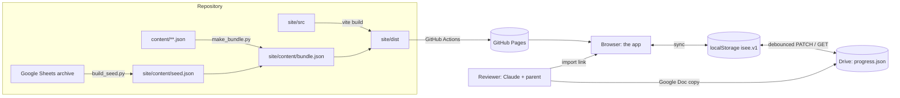
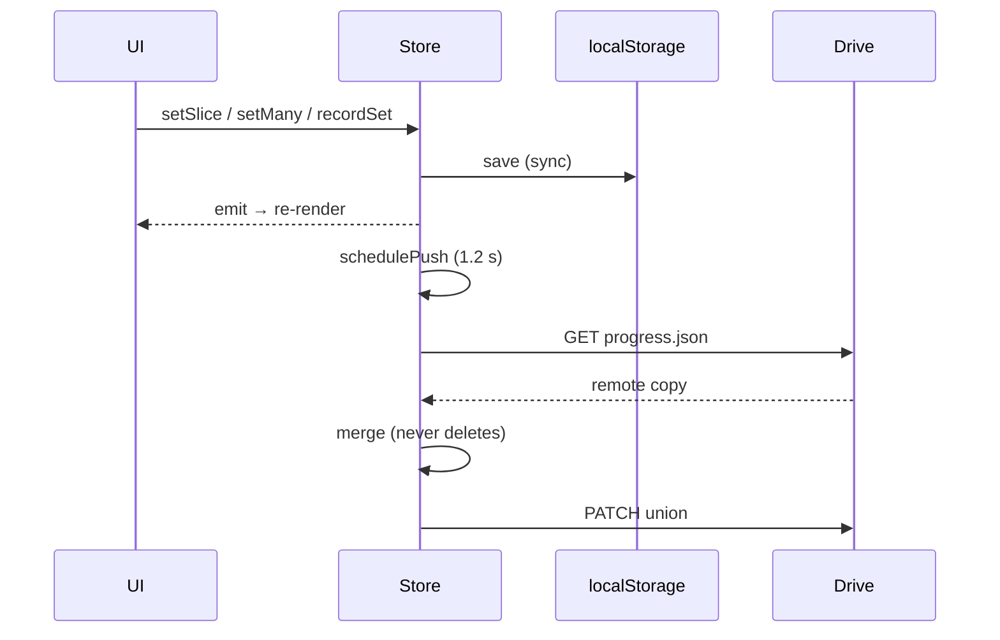

# Architecture

How the ISEE practice site is put together: what runs where, where data lives,
how it moves, and what keeps it honest. For *why* the product looks and behaves
the way it does, read [design.md](design.md). For the rules of working on the
repo, read [AGENTS.md](../AGENTS.md).

## 1. The shape in one paragraph

A **static single-page app** (React 19, Vite 8, Tailwind v4, shadcn/ui) served
from GitHub Pages at `https://learning.sheilazhang.org/`. All teaching content is
compiled from JSON in `content/` into one file, `site/content/bundle.json`, that
the app fetches at boot. All learner data is one plain object kept in
`localStorage` and mirrored to one file, `progress.json`, in the learner's own
Google Drive. There is **no server, no database, no account system** beyond
Google's, and no analytics. Everything derived (scores, review schedules,
mastery, badges) is computed on the client from the raw records, never stored.

## 2. Repository layout

| Path | What it is |
|---|---|
| `content/` | Source of truth for everything the site teaches: question banks per subject, reading passages, precision vocabulary, essay prompts + guide + rubric, mock essay prompts, calendar, book shelf, AoPS skill map. |
| `site/make_bundle.py` | Compiles `content/**` into `site/content/bundle.json`. CI fails if the committed bundle has drifted. |
| `build_seed.py` | One-off migration of Sheila's Week-1 answers from the Google Sheets workbooks into `site/content/seed.json`, applied on first load (`Store.applySeed`). |
| `site/src/lib/` | The engine. `store.js` (state + Drive), `content.js` (bundle helpers), `engine.js` (learning engine), `rewards.js` (badges, levels, shelf), `books.js` (reading log), `reviews.js` (essay reviews), `aops.js`, `router.js`, `utils.js`. |
| `site/src/pages/` | One file per route. |
| `site/src/components/` | App chrome (sidebar, header, sign-in dialog, review card) and `ui/`, the shadcn/ui primitives, copied into the repo and owned by it. |
| `site/test_*.cjs` | Four Playwright suites run against the built `dist/`. |
| `site/public/` | `sw.js` (service worker), `manifest.webmanifest`, favicon. |
| `site/oauth.json` | The Google OAuth client's public facts. No secrets anywhere in the repo. |
| `tools/` | Content validation and audit scripts, and `review_link.py`. |
| `docs/` | This file, design.md, the essay-review contract, review notes, and the original spec in `superpowers/specs/`. |
| `.claude/skills/` | Repo skills for Claude Code sessions (currently `essay-review`). |
| `build58.gs`, `RUN_ME.md` | The Apps Script that built the Google Sheets workbooks. Archive. |

## 3. Build targets

`site/vite.config.js` produces two builds from the same source, selected by
`LEARNING_TARGET`:

| Target | Command | Output | Differences |
|---|---|---|---|
| **Pages** | `npm run build` | `site/dist/` | `bundle.json` fetched at runtime; Drive sync on (`window.__ENABLE_DRIVE__`, client id injected); Google Identity Services script loaded; PWA manifest and service worker registered. |
| **Artifact** | `npm run build:artifact` | `../artifact.html` | One self-contained HTML file: bundle inlined as `window.__LEARNING__`, no Drive (the artifact origin is not an OAuth origin), no external requests, honours the host's `data-theme`. |

`base: './'` keeps every asset URL relative, which is what lets the same build
work under the `/learning/` subpath, from a file, and inside an artifact viewer.

The font is the device's own UI stack. Nothing is fetched from a font CDN, so the
artifact is offline-complete and the PWA has nothing to wait for.

## 4. Boot sequence

`site/src/main.jsx`:

1. Load the bundle (`window.__LEARNING__` if inlined, else `fetch("content/bundle.json")`), hand it to `content.js` (`setBundle`). A failed fetch renders a plain error, not a blank page.
2. `Store.init()` reads `localStorage["isee.v1"]`, creates any missing slices, and normalises legacy shapes (numeric `at`, missing `wrong[]`).
3. Apply the theme: saved choice, else the host's `data-theme`, else the OS.
4. `Store.applySeed(bundle.seed)` — idempotent migration of the Sheets results.
5. `backfill()` — creates learning records for anything answered before the engine existed. Idempotent; only ever adds.
6. `seedBooks()`, `syncBadges()`; the same three run again after every Drive merge (`Store.afterMerge`).
7. Render `<App/>`. On the Pages build the app is **gated**: until `Store.signedIn()` is true it renders the sign-in page (`pages/signin.jsx`), or a splash while `Store.resume()` silently refreshes a stored token. A returning visit therefore never sees the gate unless the silent refresh needs a click. The Google popup is never opened without one. The artifact build has no Drive and is never gated.

## 5. State

One plain object, `Store.s`, with `useSyncExternalStore` for React. No Redux, no
context tree. Any write goes through one of a handful of writers that all do the
same three things: save to `localStorage` synchronously, emit to subscribers,
schedule a Drive push.

| Slice | Keyed by | Holds |
|---|---|---|
| `results` | `sub:Wn:setIndex` | A finished practice set: `{n, right, at, wrong[], picks{}, times{}}`, plus `first`/`attempts` when redone. |
| `items` | question id (`w:word` for vocabulary) | The **learning record**: attempt history (last 40), spaced-review `step`/`due`/`cleared`, cause `tag`, confidence `sure`, miss count. |
| `precision` | week | Her explanations and confidence ratings for the 20 words. |
| `essays` | week | Plan, draft, feedback, rubric self-ratings, time log, completion. |
| `mocks` | form (`DGN`, `M01`…) | Per-section picks, timing, submission; the essay; `recorded` once fed to the engine. |
| `mixed` | timestamp id | Mixed-set results with a per-subject split. |
| `checklists` | week / month | Ticks and custom items. |
| `badges` | badge id | Pinned on first earning, never recomputed away. |
| `rewards` | `item:id`, `claim:id` | The reward shelf and claims against effort points. |
| `books` | book id | Shelf status, pages, reading sessions by day, words looked up. |
| `reviews` | review id | Essay reviews written outside the app (see §8). |
| `reviewsSeen` | review id | Which reviews she has opened. |
| prefs | — | `testDate`, `testFormat`, `pacing`, `theme`, Drive session facts. |

**Nothing derived is stored.** Accuracy, mastery, the review queue, pacing,
readiness, streaks, points and badge progress are all functions over these
slices and the bundle.

## 6. Google Drive sync

On the Pages build nothing renders until Google has said who this is (the
sign-in page is the door, in the same shape as the owner's other apps); after
that Drive is a mirror of localStorage, and losing auth mid-session never throws
her out of a half-finished set. Only a fresh load gates. The artifact build has
no Drive at all.

- **Scope** `drive.file` + `openid email profile` (non-sensitive, so the OAuth
  consent screen stays in Testing with the owner as test user). The app can only
  see files it created: a folder "Sheila ISEE Practice" and `progress.json`.
- **Token client** (Google Identity Services, implicit flow). One in-flight
  request at a time; `ensureToken()` silently refreshes a stale token before any
  call; `api()` retries once on a 401; a failed silent refresh only surfaces when
  a save actually fails (`reconnectNeeded`), never merely because a token aged out.
- **Write path**: every writer calls `schedulePush()` → 1.2 s debounce →
  `flush()` → `pull()` → `GET progress.json` → `merge(remote)` → `PATCH` the
  union. Reading before writing is what lets another device, or a reviewer
  writing straight into the file, never be overwritten. The page going hidden
  (app switch, tab close) runs the same flush at once; there is no blind write.
  An edit that still misses the window is pushed, merged, on the next open,
  because `afterAuth` always pulls and pushes.
- **Merge** (`Store.merge`): keyed slices are last-write-wins per key by `at`,
  with the richer copy kept on a tie; learning records take the newer schedule
  and **union** the attempt histories. Merging can never delete an answer.
- **Payload** `schema: 5`. Adding a slice means bumping the schema and updating
  `init`, `merge`, `body`, and `test_drive.cjs`.

## 7. The learning engine (`engine.js`)

Pure functions over `Store.s` and the bundle, plus three writers
(`recordAttempts`, `setTag`, `scheduleWord`) and the idempotent `backfill`.

- **Evidence**: an attempt counts as learning evidence in contexts `set`,
  `review`, `mixed`, `mock`, `vocab`; `corr` (redoing a question right after
  seeing the answer) does not.
- **Spaced review**: a miss is due tomorrow; each later correct answer on a
  *different day* advances through intervals of 1, 3, 7, 21 days; two steps clear
  it from the pile with one check-in three weeks later. Vocabulary rated 1 or 2
  in the precision review is scheduled the same way.
- **Error tags**: each miss can carry a cause (`know`, `misread`, `careless`,
  `rushed`) and a confidence flag. These feed the review page's breakdown and
  the mock next-steps.
- **Skills and mastery**: skills come from the question bank's `sk` field (VR is
  classified from the question text). A skill's level is derived from the latest
  attempt on each of its questions: Started → Needs work → Familiar → Proficient
  → Mastered, where Mastered needs two correct answers in a mixed set or mock on
  a later day.
- **Mixed sets**: a deterministic-per-day interleaved set from weeks already
  reached, weighted toward skills that can be promoted and skills that are weak.
- **Pacing**: per-subject second budgets from the real test (VR 35, QR 55, RC 60,
  MA 60). Timed answers give a median, the share inside budget, and the
  "slow but right" / "fast and wrong" counts.
- **Mocks**: a finished form feeds the engine once (`recordMockForm`); the score
  band converts section percentages to an *estimated* stanine and reports a
  range across the last three mocks; `mockNextSteps` turns misses, blanks,
  timing and tags into three concrete things to do.
- **Activity, streaks, effort**: every timestamped record contributes to activity
  days; the streak freezes rather than breaks for up to two missed days a week;
  effort points reward attempts, not accuracy.
- **Readiness**: a 0–100 score with a transparent breakdown (accuracy 30, mocks
  20, mastery 20, pacing 10, review health 10, consistency 10), recomputable as
  of any past date for the trend line, and one piece of advice: the largest
  weighted shortfall, or an overdue pile if half of it is late.

`rewards.js` reads the same records to work out badges, then **pins** each on
first earning so a later dip can never un-earn it. Levels come from lifetime
effort points; spending on the reward shelf never costs a level. Rooms and
rewards share one wallet, settled by replaying both ledgers in order (`ledger()`)
so a purchase can never take Hum that did not exist when it was made — the
balance is a subtraction that always adds up and never needs clamping.

## 8. Essay reviews

A parent asks Claude to review an essay. Because the site holds only
`drive.file`, a review cannot be dropped into Drive for the site to find; it
enters through the site as an **import link** (`#/import/<base64url JSON>`) or
the paste box, lands in `reviews`, and syncs like everything else. A Google Doc
copy is kept in the family's Drive folder. The contract, the review shape and
the workflow are in [review.md](review.md); the repo skill
`.claude/skills/essay-review/` runs it.

## 9. Content pipeline

`content/**` is the only place teaching material is edited. `make_bundle.py`
assembles it, together with `seed.json`, into `bundle.json` (`version` bumps with
content changes). The bundle carries: subjects (question banks, 834 items),
passages, the eight plan weeks with start dates and breaks, precision words,
the essay module, mock definitions and items, the calendar, the book shelf, the
AoPS map, and the seed. `content.js` exposes it as `D` plus helpers such as
`setsFor` (splits a week's questions into near-equal sets of at most 12, mirrored
by `build_seed.py` so migrated results line up) and `currentWeek`.

Content rules (never invent a fact, sources on dates and chapters, written for a
ten-year-old, keys fact-checked) are in AGENTS.md.

## 10. Routing and pages

Sixteen lines of hash routing (`router.js`): `#/a/b/c` → `["a","b","c"]`;
`App.jsx` maps the first segment to a page. Hash routes are what make GitHub
Pages (no server rewrites) and the single-file artifact work identically.

| Route | Page |
|---|---|
| `/` | Dashboard: Today card, readiness, subjects, this week's checklist, rewards, reading. |
| `/s/:sub[/:wk]` | Subject overview, sets per week, skill levels. |
| `/run/:sub/:wk/:n` | The runner: one set, timed per question, pacing mode. |
| `/review[/:sub[/checkin|all]]` | The spaced-review pile. |
| `/precision/:wk[/quiz]` | Precision words: explain and rate; the synonym quiz. |
| `/mixed[/run]` | Mixed sets. |
| `/essay[/:wk]` | Essay weeks: plan, draft, revise, guide, time log, reviews. |
| `/mock[/:form[/:section|ESSAY|corrections]]` | Timed mock exams. |
| `/calendar` | ISEE dates, school sittings, the plan on a timeline. |
| `/checklist[/:wk | /month/:m]` | Weekly and monthly checklists. |
| `/score`, `/rewards`, `/books` | Readiness detail, badges and shelf, reading log. |
| `/import[/:payload]` | Add an essay review. |

Every page is reachable and escapable from the breadcrumb; on phones the
sidebar is a drawer, so nothing lives only there.

## 11. Testing and deployment

Four Playwright suites run real Chromium against the built `dist/`:

| Suite | Covers |
|---|---|
| `test_e2e.cjs` | Desktop and phone shells, navigation, a full set, persistence. |
| `test_drive.cjs` | Google stubbed at the network layer: sign-in once, reload without a prompt, silent refresh, reconnect on failure, merge conflicts, a review arriving from Drive and surviving a save. |
| `test_features.cjs` | Precision, essay (time log, reviews), mocks, calendar, checklist, learning engine, rewards, reading log, AoPS pointers, dashboard. |
| `test_artifact.cjs` | The single-file build: no Drive, no external requests, host theme. |

Before a commit: `cd site && npm run build && npm test`, then
`python3 site/make_bundle.py && git diff --exit-code -- site/content/bundle.json`.

Deployment is `.github/workflows/pages.yml`: on a push to `main` touching
`site/**` or `content/**` it rebuilds the bundle, fails if it drifted, runs
`npm ci && npm run build`, and publishes `site/dist` to GitHub Pages.

## 12. Invariants worth knowing

- **Learner input is sacred.** No writer deletes an answer; merges union; the
  seed and backfill only add; "remove" is a flag.
- **Idempotent boot.** `applySeed`, `backfill`, `seedBooks`, `syncBadges` run on
  every load and after every merge and must stay additive.
- **Honest numbers.** A score with no data renders "—", not 0; stanines are
  labelled estimates.
- **No popup without a click.** Browsers block it; the app never tries.
- **Two builds, one source.** Anything that touches the network must be gated on
  `DRIVE_ENABLED` so the artifact stays offline-complete.
