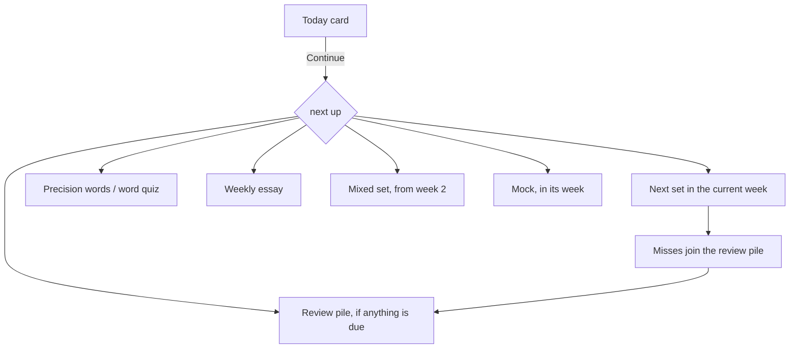

# Design

Why the practice site looks and behaves the way it does. This is the product and
interface design record; the system underneath is in
[architecture.md](architecture.md). The world the practice happens inside — the
cats, the Wordwood, the Den — is decided in [world.md](world.md), and how it
sounds and moves in [cats.md](cats.md). This file says where things sit and how
they behave; those two say what they are and why they exist at all.

## 1. Who it is for

One child, Sheila, ten, preparing for the ISEE Lower Level over eight plan weeks
in the autumn of 2026, and the parent who sits beside her. She uses it on an
iPad and a laptop, sometimes on a phone in the car. The parent uses it to see
what to do next, to tick the things a parent does, and to review her essays.

That single audience explains most decisions: there is no onboarding, no
settings page, no empty-state marketing. The app already knows the plan, the
dates, and her name.

## 2. Principles

1. **Today first.** The first thing on every visit is the one thing to do now,
   with a button that does it. Everything else is below the fold.
2. **A child uses this.** Nothing that makes a bad session feel like failure. No
   streak that punishes a missed day, no leaderboard, no red numbers as decoration.
   Effort is rewarded; accuracy is reported.
3. **Honest numbers.** A score with no data says "—". Estimates say they are
   estimates. The readiness score shows its own breakdown.
4. **Her work is hers.** Answers, essays, ratings and reading days are never
   overwritten or lost, and they live in the family's own Google Drive.
5. **Nothing to wait for.** No webfont, no backend, no spinner on load. The
   device's own UI font, a local-first store, and a service worker.
6. **One meaning per colour.** Red means due now. Amber means still to do this
   week. Green means done or earned. A dot means something new. Never a standing
   count that looks like an alarm.

## 3. The plan the interface follows

Eight plan weeks with breaks, four subjects (Verbal, Quantitative, Math,
Reading), a weekly essay, a precision-vocabulary review, a spaced review pile,
and four timed mocks (a split diagnostic in September, then three full mocks).
The interface does not ask her to plan; the plan is data, and the pages read it.

Due review comes before new work. That single ordering rule is what the Today
card, the sidebar's Continue button and the weekly checklist all share, so they
never disagree.

## 4. Layout

**Shell.** A sidebar (a drawer on phones) with Continue at the top, the main
areas, then the subjects with a small progress count. A sticky header with a
breadcrumb, the Drive status, and the theme toggle. Content sits in a
container-queried main column (`@md/main:` and `@2xl/main:`), so layouts respond
to the space they actually have, not the viewport.

**Pages are stacks of cards.** Each card has one job and a plain title. The
first card on a page is the summary; the cards below are the work. On phones
the stacks are single-column and every control wraps rather than overflows.

**Breadcrumb as escape hatch.** Every page can be left from the top of the page.
A set in progress, a timed mock, a review run: all of them keep the trail.

## 5. Page by page

- **Dashboard.** The Today card names the next thing and lists what else the
  week still expects, with an unread essay review first because someone wrote
  it for her. Readiness (one number, six labelled parts, one piece of advice),
  subjects as rows, this week's checklist showing only what is left, rewards
  (level, Hum to spend, the closest badge), reading (the current book, one
  tap to log today).
- **The runner.** One question at a time, four choices, keyboard A–D and Enter.
  A soft pacing timer, off by default, against the real test's per-question
  budget; nothing auto-advances. After a set: score, per-question pacing, and a
  cause tag for every miss ("Didn't know it", "Misread it", "Careless slip",
  "Ran out of time") because the tag is what makes the review pile useful.
  The reveal is where most of the teaching happens, and it is stacked in order of
  how personal it is: **what her own wrong number was** ("30 is 10 × 3, the
  area") where that can be said truthfully, then the lesson card for the skill,
  then the explanation, then somewhere to go and read more. The first of those is
  the only one that knows what she actually did, so it goes first.
- **Review.** What is due now, what is scheduled, what is up for a check-in, and
  why misses happen. One button per subject starts a run.
- **Precision words.** Twenty words a week in her own words with a 1–3
  confidence rating, then a synonym quiz on a later day that looks like an ISEE
  question. A word is *known* only when both have happened on different days.
- **Essay.** One prompt a week. Plan · 5, Draft · 20, Revise · 5 as tabs with a
  countdown each; a time log she can fill in by hand or from the timer's Stop;
  self-check ratings and a growth rubric with the next step for her level; a
  review card from a reader, above the tabs, when one exists.
- **Mocks.** Sections in order, a clock that does not pause, the essay prompt
  hidden until Start, misses hidden until the whole form is done so a diagnostic
  cannot be rehearsed. Results give raw scores, an estimated stanine per section
  labelled as such, three next steps, and a corrections drill that does not
  change the recorded score.
- **Reading.** The shelf (reading, then the list, then finished), a reading-day
  log with a date so a forgotten day can be added, page progress, words she
  looked up, and a list of well-known books chosen for ISEE reading skills.
- **Checklist.** The week's work ticks itself; parent to-dos and dates are ticked
  by hand; custom items go on either list.
- **Calendar.** Real ISEE seasons, the school sittings, application deadlines,
  the plan weeks and mocks on one timeline, with the test date as a one-tap pick.
- **Score.** How the readiness number is built, per subject, with a trend line.
- **Rewards.** Level and lifetime Hum, badges earned and progress toward the
  rest, and a reward shelf the parent stocks and she claims from.
- **Subjects and mixed practice.** A subject page is the week's sets with skill
  levels beneath; the mixed set is twelve questions across all four, which is how
  a Proficient skill is promoted to Mastered.
- **The Wordwood.** Vocabulary as the thing it already is: a sentence with a word
  taken out, and she calls the name into the dark. The right name brings that cat
  through the gate; the wrong one brings the cat she actually named, doing what
  *that* word means. Every cast is recorded as ordinary vocabulary practice, so
  playing is practising rather than a reward for it.
- **The Den and the Glimbook.** Seven things a cat really needs, bought with Hum
  and lit by real mastery, each teaching sourced care guidance; and the
  collection, every cat she has met at its true brightness, half-learned ones
  standing half-lit.
- **Sign-in.** One door. It says where the data goes before she opens it, and a
  returning visit never sees it.

The three game surfaces are designed in [world.md](world.md) and
[cats.md](cats.md), not here — this section says where they sit in the app, and
those say what they are and why. The rule they turn on is that the content must
*be* the mechanic, which is why vocabulary has a game and arithmetic does not.

## 6. Visual system

**Palette: "Arcade".** An indigo primary on a cool off-white, with warm amber and
rust for warning and destructive so red-green colour vision still gets a
difference in temperature, not just hue. Tokens live in `site/src/index.css` and
are the only source of colour; components never carry a hex value.

| Token | Light | Dark | Used for |
|---|---|---|---|
| `--primary` | `#5b4bdb` | `#8b7cff` | Actions, the current week, the "new" dot |
| `--success` / `--success-soft` | `#1a8d55` / `#d9f2e5` | `#56c08d` / `#152f23` | Done, earned, complete |
| `--warning` / `--warning-soft` | `#9a6a0c` / `#fbeecd` | `#d8ae5c` / `#2b2415` | Still to do this week, in progress |
| `--destructive` | `#c9502f` | `#e08a68` | Due now, over time, fast-and-wrong |
| `--chart-1…4` | indigo, blue, amber, rust | lighter versions | One colour per subject, stable everywhere |

**The palette is split, and that split is the point.** The shell is game chrome —
the sidebar stays deep indigo in both themes, the way a game's chrome is dark
whatever the OS is doing. The reading surface stays a plain light card with
near-black type, because on the day it counts the question is black on white
paper, and practice should not train her to read anything more decorated than
that. Indigo is identity only: it never carries one of the three meanings.

Controls are chunky and pressable — a hard offset shadow in the same hue,
darker, that shortens when the control is pressed so it behaves like a physical
key (`--primary-press`, `--lift`).

**Alternate palettes are one constant.** `src/skins.css` holds several — red,
neon, candy, sunset, forest — chosen by a `SKIN` constant in `main.jsx` that sets
`data-skin` on the root. A skin may only override tokens that carry hue: the
semantic four are pinned in `index.css` and no skin can reach them, so changing
the look can never change what a colour on the page *means*.

**Dark mode is a theme, not an inversion.** Backgrounds go to a deep indigo-black,
the primary lightens to keep contrast, soft tints become dark tints. The choice
follows the saved preference, then the host's `data-theme` (the artifact
viewer), then the OS, and `theme-color` updates with it.

**Type.** The device's own UI font. Sizes are Tailwind's scale; body copy is
`text-sm` to `text-[15px]`, titles `text-xl`/`text-2xl` semibold with tight
tracking. Every number is `tabular-nums`. Dates go through `fmtDate` ("Sep 5").

**Components.** shadcn/ui primitives copied into `src/components/ui/` and owned
by the repo: Card, Button, Badge, Input, Textarea, Tabs, Progress, RadioGroup,
Dialog, Sheet, Sidebar, Tooltip, Table, Chart. If a component is missing it is
added there, never hand-rolled as a div. Icons are lucide, sized `size-4` in
text and `size-3.5` in captions.

**Badges carry meaning, not decoration.** `success` for done, `warning` for in
progress, `outline` for not started, `secondary` for neutral facts (word counts,
minutes), `default` only for "This week" and "New".

## 7. Interaction rules

- **One door, then no more asking.** The site opens on a sign-in page that says
  in three lines where her work lives and what the site can see, with one Google
  button. A returning visit is signed back in silently behind a splash; only when
  that needs a click does she see the door again, and then it says "Welcome
  back". Losing auth mid-session never interrupts a set: the header chip says
  Reconnect and she keeps working. Never a popup without a click.
- **Autosave, visibly.** Text fields save on a short debounce and on blur; the
  header shows "Saved to Drive" or "Saved on this device". No Save buttons on
  forms, only on actions that mean something (submit a set, finish a book).
- **Destructive actions confirm.** Submitting a mock section, removing a book.
  Everything else is reversible in place: tap a logged day to take it back,
  reopen an essay, cancel a claim.
- **Progress bars are thin.** `h-1.5`, one per card at most, always with the
  number beside them. A bar is a glance, not a score.
- **Timers are honest.** They run off the wall clock so a background tab or a
  reload does not stretch the time. Practice timers can be stopped or reset;
  mock timers cannot be paused.
- **Keyboard on desktop.** A–D pick, Enter continues, in every runner.

## 8. Words

The interface speaks to Sheila in the second person and to the parent in plain
English, and it is the same voice in both cases: short sentences, concrete
nouns, no exclamation marks. "Write at least a short draft first." "Nothing
overdue." "This one was hard. Work through the notes slowly — that is what
moves the score."

A few fixed phrases carry the product's stance:

- "I read today", not "Log session".
- "Due now", "still to do", "done", never "overdue!" or "missed".
- "Estimated stanine ≈ 6", never a bare stanine.
- "Reviewed" and "What a reader noticed", never "Graded".

Explanations, vocabulary and essay guidance are written for a ten-year-old
without talking down: one idea per sentence and a concrete example.

## 9. Motivation without pressure

**Hum** comes from attempts, not accuracy: a set is 10, a mixed set 12, a mock
section 25, a finished essay 15, a precision word 2, a review answer 1, tagging a
miss 3, a reading day 4, a finished book 40. It was called "effort points" until
the world gave it a name — practice makes warmth, and warmth is what draws the
cats in (docs/world.md §4). Levels are lifetime Hum and cannot go down. Badges
are earned once and pinned; a dip in accuracy or a growing review pile never
un-earns one, and tiers are separate badges so a bigger one never replaces a
smaller one. The streak freezes for up to two missed days a week instead of
breaking. The reward shelf turns Hum into things the family actually does (a
movie pick, boba, a book she chooses) and the parent marks them given.

The review pile is framed as questions to *retire*, and retiring one earns a
badge. The point is that a miss is the start of something, not a mark against her.

## 10. Feedback from people

Self-check first, then a reader. The essay page carries her own ratings and a
rubric with the next step for her level; a review from a parent or from Claude
arrives as a card under the prompt, written to her, with what worked before what
to try, at most three suggestions, and one change for next week. Unread reviews
are a dot, not a number. A review of an older draft says so rather than looking
wrong.

## 11. Responsiveness and access

- Phone widths are first-class: every screenshot in a change is checked at 390
  px, and every control row wraps.
- Container queries inside the shell, so the sidebar opening does not break a
  page's layout.
- Buttons have visible focus rings; icon-only buttons carry `aria-label`s;
  radio groups are real radio groups; colour is never the only signal (a badge
  always has a word).
- Text contrast is checked in both themes; the soft tints exist so that
  coloured text sits on a tinted ground rather than the page background.

## 12. What this design deliberately leaves out

- Accounts, a backend, analytics, notifications, email. The family's data is in
  their Drive and nowhere else.
- A leaderboard, a global timer, a daily quota, red "overdue" counts.
- A tutor chatbot inside the app. Feedback comes from people; Claude helps the
  parent write it and the review is a document, not a chat.
- Settings. The plan, the dates and the palette are decisions, not options —
  alternate skins exist but are a constant in the source, not a picker she has to
  have an opinion about.

## 13. Verification habit

A change is not done until the page has been looked at on desktop, at phone
width and in dark mode. Several regressions in this repo were invisible in the
diff and obvious in the screenshot.
